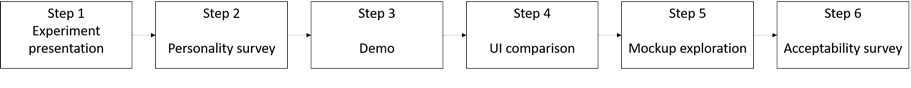

# Exploring the Acceptability of HELP-XR among Instructors: A Tool for XR Pedagogical Content Creation
[](https://doi.org/10.1145/3656650.3656681)

[](https://doi.org/10.1145/3656650.3656681)
[](https://colab.research.google.com/github/ERPI-UL/helpxr-instructor-acceptability/)

This repository contains the dataset and analysis conducted for research on the acceptability of the HELP-XR authoring tool among instructors.

Data analysis are avaialbe in the 'step2' and 'step6' folders. [The first one](/step2-GCASSurvey/step2-GCASAnalysis.ipynb) analyses demographic data and GCAS data. [The second one](/step6-UTAUT2/Step6-UTAUT2.ipynb) examines UTAUT2 scores in relation to demographic and GCAS scores.

__Authors:__ 
* Alex Gabriel
* Josselin Deborde

__Coordinators:__ 
* Alex Gabriel
* Alaa Hassan

## Details 
This experimentation involved 14 persons in a 6-step process. Among these 6 steps, this analysis considers steps 2 and 6. 

* Step two involved collecting demographic data and administering the Greek Computer Attitude Scale [(Roussos, 2017)](http://doi.org/10.1016/j.chb.2004.10.027) to every participant. Although the survey was conducted in French, metadata concerning the questions are avaialbe in [French](/step2-GCASSurvey/step2-metadata-FR.csv) and in [English](/step2-GCASSurvey/step2-metadata-EN.csv). An export of the questionnaire created with LimeSurvey is also available in the step2 folder [here](/step2-GCASSurvey/step2-GCASSurvey-backup.lss)  
* Step six involved evaluating the UTAUT2 [(Venkatesh et al., 2012)](http://doi.org/10.2307/41410412) scores for each participant. The questions were in French, but metadata are available in both [French](/step6-UTAUT2/step6-metadata-EN.csv) and in [English](/step6-UTAUT2/step6-metadata-FR.csv). An export of the LimeSurvey questionnaire is also alvailable the step6 folder: [here](/step6-UTAUT2/step6-UTAUT2-limesurvey_survey_backup.lss).

## Reproduce the analysis 

### Online
Open this repository using Google Colab: [](https://colab.research.google.com/github/ERPI-UL/helpxr-instructor-acceptability/)

### Locally 
1. Install the environment
    ```sh
    python -m venv .

    # for windows 
    Scripts\activate
    # Linux
    source bin/activate

    pip install -r requirements.txt
    ```
2. Start jupyter
    ```sh
    jupyter notebook
    ```
3. Use jupyter interface (in the browser though) to access to the file

4. Run the notebook